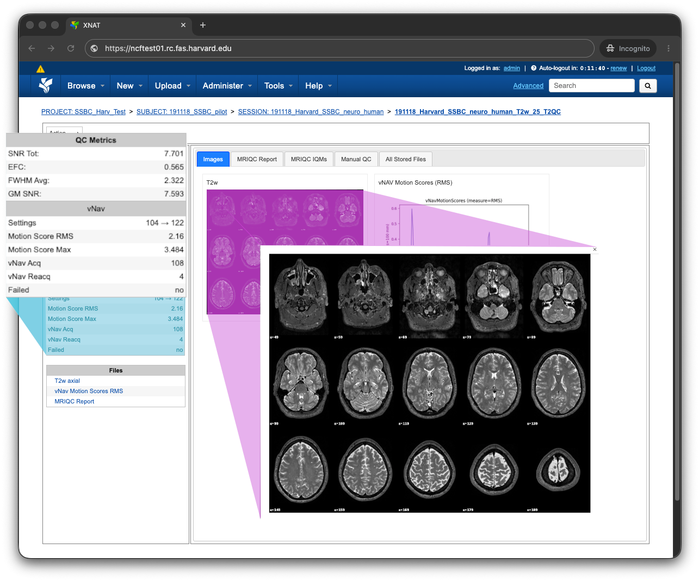

# Welcome to T2QC!

T2QC is a T2-weighted MRI quality control pipeline built on
the excellent [MRIQC][] and [volumetric navigators][vNav] 
software packages.

Working closely with neuroimaging experts, we developed a comprehensive quality
control pipeline and user interface for the [XNAT][] informatics and data 
management platform. T2QC allows neuroimaging researchers to quickly assess 
T2-weighted image quality, and use those insights to respond to data acquisition 
issues.

Please refer to the main menu for detailed documentation!

[MRIQC]: https://doi.org/10.1371/journal.pone.0184661
[vNav]: https://github.com/harvard-nrg/vnav
[XNAT]: https://www.xnat.org
