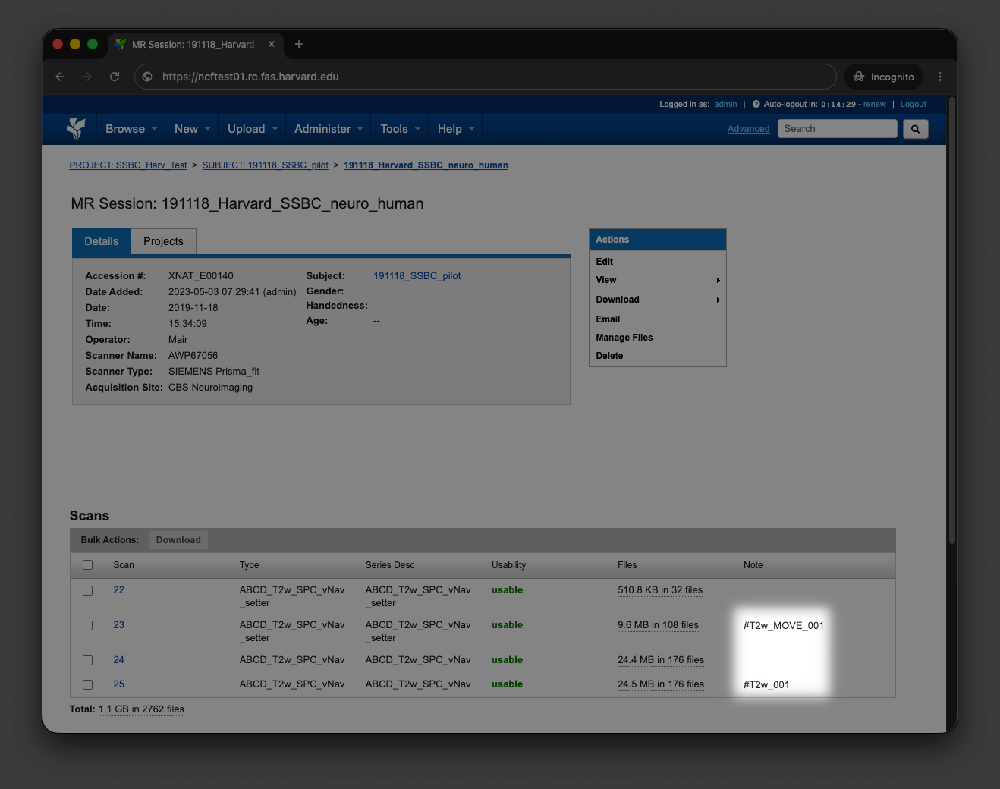
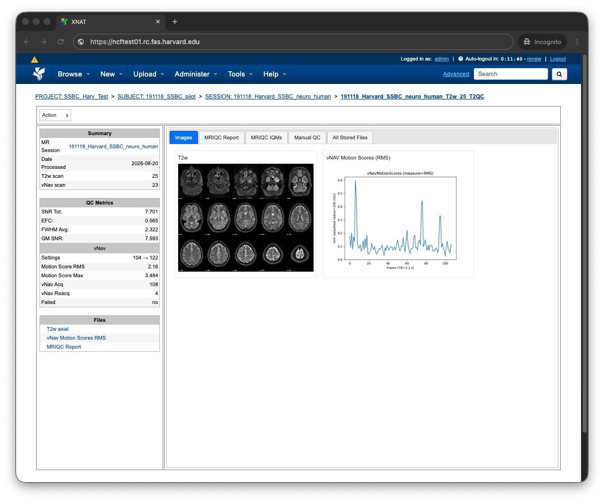
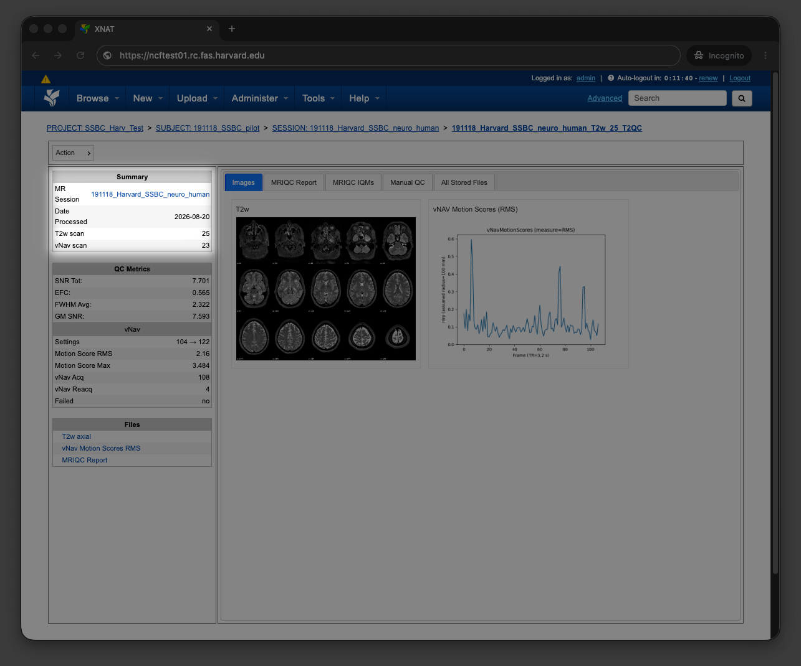
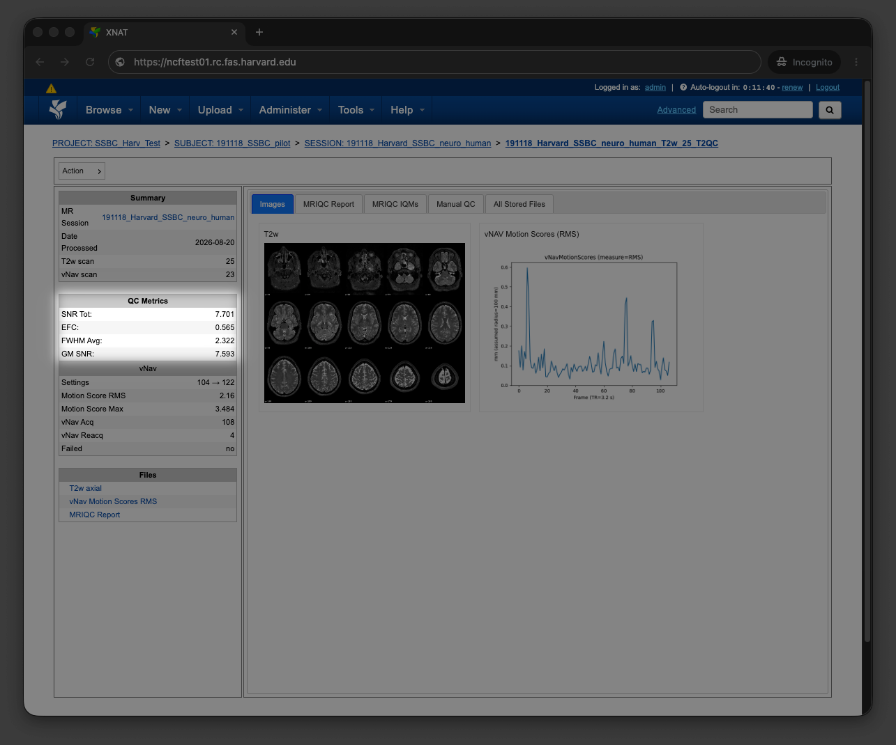
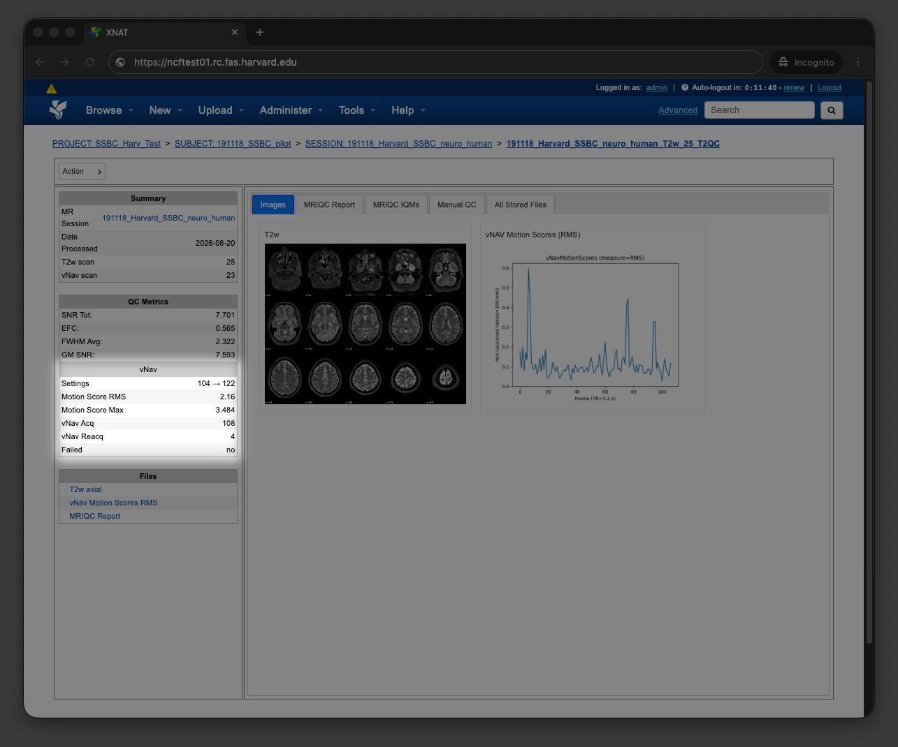
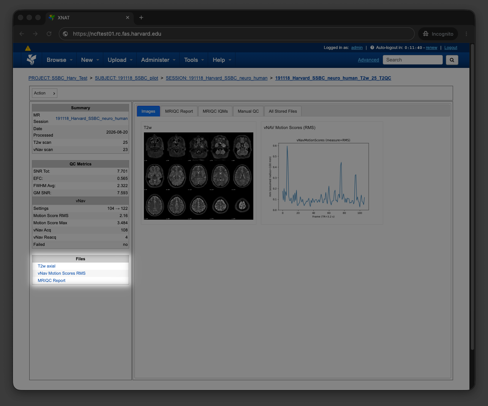
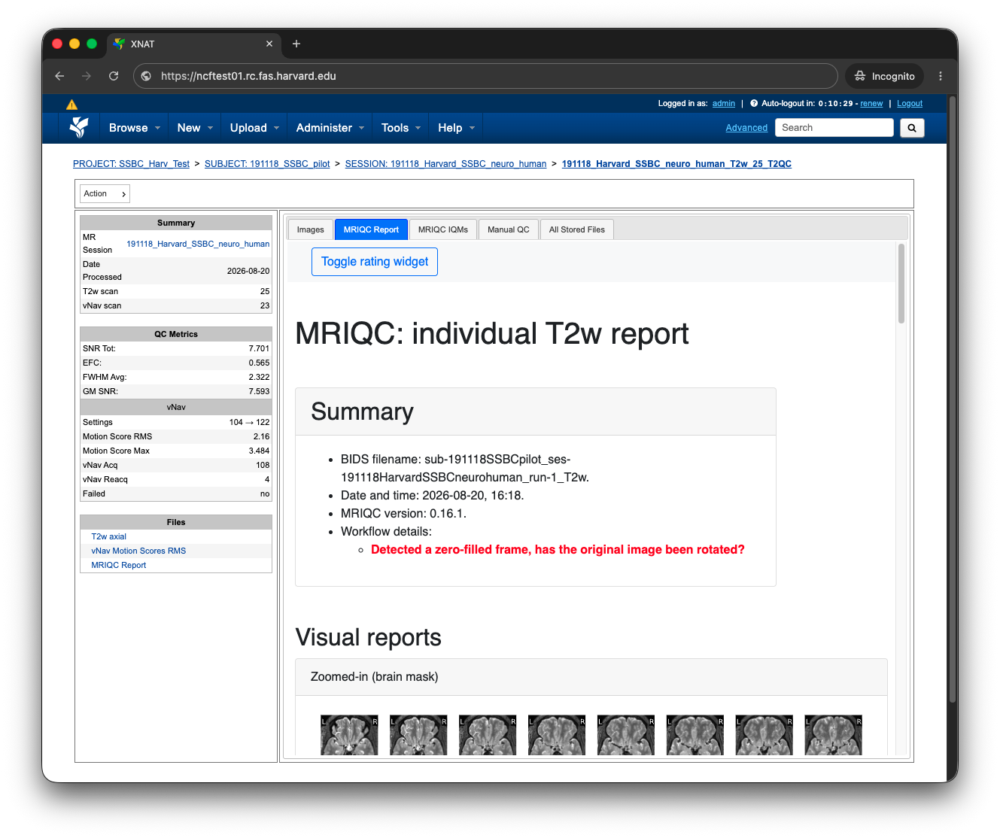
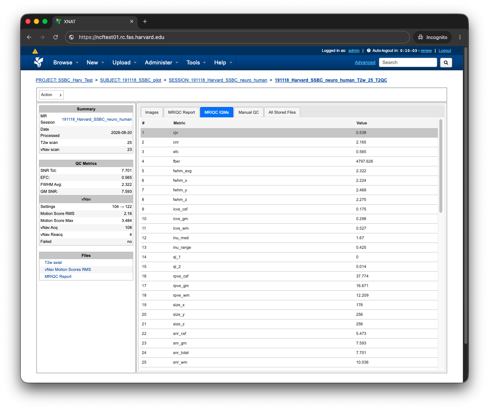
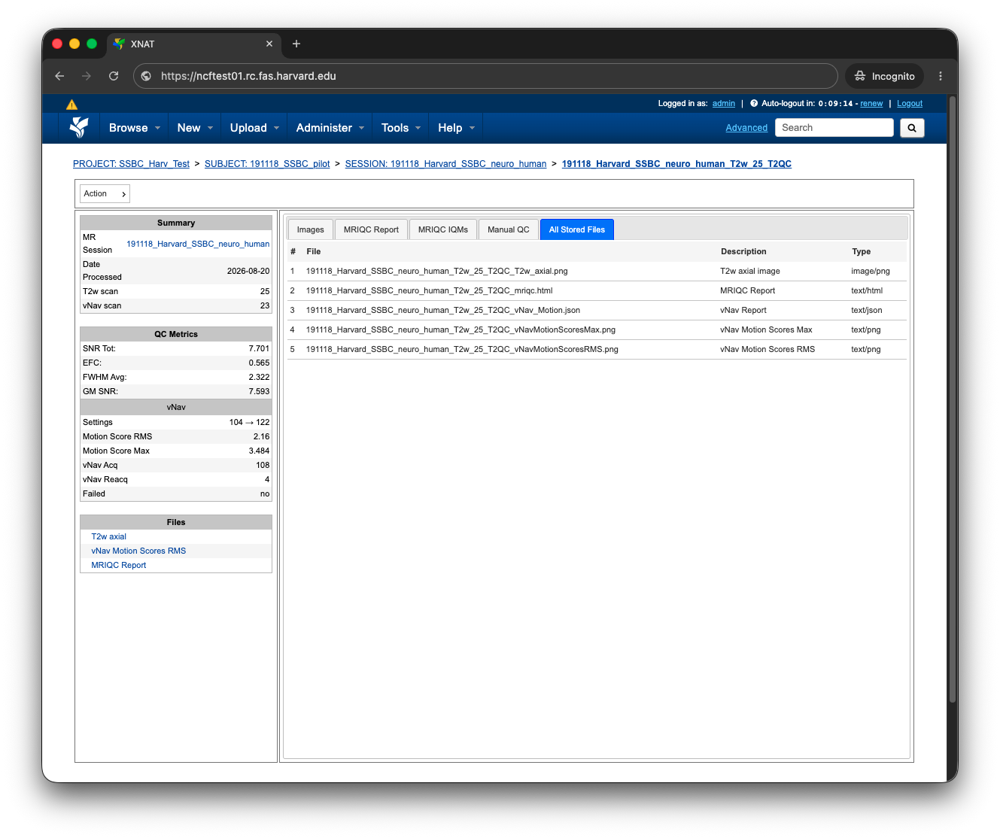

# Users Guide

## Running T2QC
While you are welcome to install T2QC and all of its dependencies manually, 
using one of the [prebuilt containers][Container download] is the most reliable 
way to run T2QC. The remainder of this section will assume that you are running 
T2QC using an [Apptainer/Singularity][Apptainer] container.

### Modes
T2QC is broken up into three modes: [get][], [process][], and
[tandem][].

#### get
If you have followed the [Tagging your scans][] section, the `get` mode can be 
used to automatically download your [T2w][] and optional [vNav][] scans from 
your [XNAT][] installation, and seamlessly convert them to [BIDS][]

```bash
singularity run -c --pwd /sw/apps/t2qc t2qc.sif \
    get \
    --xnat-alias ${XNAT} \
    --label ${XNAT_SESSION_LABEL} \
    --run ${RUN} \
    --bids-dir ${BIDS_DIR}
```

#### process
The `process` mode will run T2QC on a specific [T2w][] and optional [vNav][] 
scan from a [BIDS][] directory. You are only responsible for leading T2QC to 
your data by supplying the [BIDS][] root directory `--bids-dir`, subject 
`--sub`, session `--ses`, and run `--run`

!!! note "XNAT upload is optional"
    If you are not interested in uploading the final results to your 
    [XNAT][] installation, you may omit the `--xnat-alias` and 
    `--xnat-upload` arguments.

```bash
singularity run -c --pwd /sw/apps/t2qc t2qc.sif \
    process \
    --sub ${BIDS_SUBJECT} \
    --ses ${BIDS_SESSION} \
    --run ${BIDS_RUN} \
    --bids-dir ${BIDS_DIR} \ 
    --xnat-alias ${XNAT} \
    --xnat-upload
```

#### tandem
The `tandem` mode simply runs the [get][] and [process][] modes in 
tandem

!!! note "XNAT upload is optional"
    If you are not interested in uploading the final results to your 
    [XNAT][] installation, you may omit the `--xnat-upload` argument.

```bash
singularity run -c --pwd /sw/apps/t2qc t2qc.sif \
    tandem \
    --xnat-alias ${XNAT} \
    --label ${XNAT_SESSION_LABEL} \
    --run ${RUN} \
    --bids-dir ${BIDS_DIR} \ 
    --xnat-upload
```

## XNAT Integration
### Tagging your scans
The [get][] mode of T2QC is able to pull your data down from an [XNAT][] 
installation and convert the data directly to [BIDS][]. For this to work, T2QC 
must have a way to automatically find your [T2w] and optional [vNav][] scans.

To identify your [T2w][] and [vNav][] scans, you must enter special *tags* into 
the note fields for those scans within [XNAT][]. You can add notes using the 
`Edit` button located within the `Actions` box on the MR Session report screen, 
or automate this using the [XNAT Scans API][]. The screenshot below shows a MR 
Session report page with populated notes

!!! note "Linking a `T2w` to its corresponding `vNav`"
    While it is often the case that a `vNav` scan is exactly one or two scans 
    before its corresponding `T2w` scan, it feels wrong to hardcode that 
    assumption into T2QC. For that reason, you are responsible for linking your 
    `T2w` scan to its corresponding `vNav` by assigning matching run numbers when 
    you are entering the tags. For example, a `vNav` scan with the tag 
    `#T2w_MOVE_001` would correspond to the `T2w` scan with the tag `#T2w_001`.



Below are more examples of MRI series descriptions and their corresponding notes
 
| Scan Type   | Series Description         | Note                                               |
|-------------|----------------------------|----------------------------------------------------|
| `T2w`       | `ABCD_T2w_SPC_vNav`        | `#T2w_001, #T2w_002, ..., #T2w_N`                  |
| `vNav`      | `ABCD_T2w_SPC_vNav_setter` | `#T2w_MOVE_001, #T2w_MOVE_002, ..., #T2w_MOVE_N`   |

### Understanding the report page
The following section will break down each section of the T2QC report page.



#### Left pane
The left pane is broken up into several sections. Each section will be described
below.

##### Summary
The `Summary` section orients the user to the MR Session they're currently 
looking at, in addition to various processing details



| Key            | Description           | 
|----------------|-----------------------|
| MR Session     | MR Session label      |
| Date Processed | Processing date       |
| T2w scan       | T2-weighted scan used |
| vNav scan      | vNav setter scan used | 

##### QC Metrics
The `QC Metrics` section displays important quality control metrics computed 
*over the entire volume*



| Metric       | From       | Description                                       |
|--------------|------------|---------------------------------------------------|
| [SNR Tot][]  | [MRIQC][]  | Signal-to-noise ratio                             |   
| [EFC][]      | [MRIQC][]  | [Entropy Focus Criterion][]                       |
| [FWHM Avg][] | [MRIQC][]  | FWHM of spatial distribution of voxel intensities |
| [GM SNR][]   | [MRIQC][]  | Gray matter signal-to-noise ratio                 |

##### vNav
The `vNav` section displays vNav-specific quality control metrics. This section
will only appear if a vNav scan was detected and processed



| Metric           | Description                                                         |
|------------------|---------------------------------------------------------------------|
| Settings         | Minimum and maximum number of navigators configured by the protocol |
| Motion Score RMS | Root mean square of motion scores per minute                        |
| Motion Score Max | Maximum motion score per minute                                     |
| vNav Acq         | Total number of navigators collected                                |
| Reacquisitions   | Number of navigator reacquisitions beyond the minimum               |
| Failed           | `yes` or `no` if a vNav failure was detected                        |

##### Files
The `Files` section contains the most commonly requested files. Clicking on any 
of these files will display the file in the browser



| File                   | Description                                    |
|------------------------|------------------------------------------------|
| T2w axial              | T2-weighted image, axial plane                 |
| vNav Motion Scores RMS | vNav motion scores RMS plot                    |
| [MRIQC][] Report       | [MRIQC][] HTML report                          |

#### Tabs
To the right of the left pane, you'll find a tabbed container. The following 
section explains the contents of each tab.

##### Images
The `Images` tab displays a mosaic view of the T2-weighted image and
a plot of the vNav RMS motion scores


Clicking on any image within the `Images` tab should display a larger version of 
the image within the browser.

!!! question "How are these images created?"
    When generating the axial view of the T2w image, T2QC automatically crops 
    and centers each brain slice for improved visibility. For this reason, some 
    slices will often appear larger than their actual size.

##### MRIQC Report tab
The `MRIQC Report` tab displays the full downstream MRIQC HTML report



##### MRIQC IQMs
The `MRIQC IQMs` tab displays all of the MRIQC [Image Quality Metrics][] in a
convenient tabular format. These metrics can also be found within the MRIQC HTML 
Report



##### All Stored Files
The `All Stored Files` tab contains a list of every file stored by T2QC.
Clicking on any of these files will download the file



| File                            | Description                        |
|---------------------------------|------------------------------------|
| `*_T2QC_T2w_axial.png`          | T2-weighted image, axial plane    |
| `*_T2QC_mriqc.html`             | MRIQC HTML report                 |
| `*_T2QC_vNav_Motion.json`       | vNav processing output            |
| `*_T2QC_vNavMotionScoresMax.png` | vNav motion max plot             |
| `*_T2QC_vNavMotionScoresRMS.png` | vNav motion RMS plot             |


[T2w]: https://bids-specification.readthedocs.io/en/stable/modality-specific-files/magnetic-resonance-imaging-data.html#non-parametric-structural-mr-images
[vNav]: https://doi.org/10.1002/mrm.23228
[XNAT]: https://doi.org/10.1385/NI:5:1:11
[Setting up the container]: ../admin/#setting-up-the-container
[MRIQC]: https://doi.org/10.1371/journal.pone.0184661
[SNR Tot]: https://mriqc.readthedocs.io/en/latest/iqms/t2w.html
[CNR]: https://mriqc.readthedocs.io/en/latest/iqms/t2w.html
[EFC]: https://mriqc.readthedocs.io/en/latest/iqms/t2w.html
[Entropy Focus Criterion]: http://dx.doi.org/10.1109/42.650886
[FWHM Avg]: https://mriqc.readthedocs.io/en/latest/iqms/t2w.html
[WM SNR]: https://mriqc.readthedocs.io/en/latest/iqms/t2w.html
[GM SNR]: https://mriqc.readthedocs.io/en/latest/iqms/t2w.html
[Image Quality Metrics]: https://mriqc.readthedocs.io/en/latest/iqms/t2w.html
[Container launch settings]: #container-launch-settings
[BIDS]: https://bids-specification.readthedocs.io/en/stable/
[XNAT Scans API]: https://wiki.xnat.org/xnat-api/image-session-scans-api
[Apptainer]: https://apptainer.org/
[Tagging your scans]: #tagging-your-scans
[Container download]: ../admin#downloading-the-container
[get]: #get
[process]: #process
[tandem]: #tandem 
